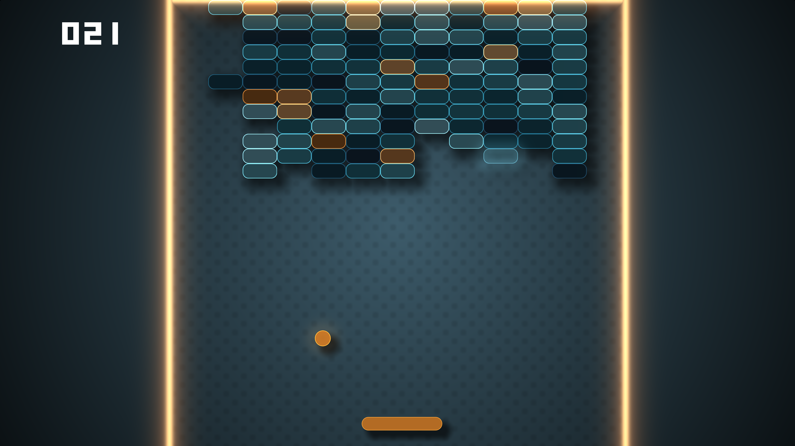

<figure class="fullwidth">
  
  <figcaption>
    A <a href="https://www.shadertoy.com/view/MsX3Wj">shader</a> from{' '}
    <a href="https://www.shadertoy.com">Shadertoy</a> running fullscreen on the Rapsberry Pi
    official touchscreen
  </figcaption>
</figure>

[^tldr] As far as I can remember, I've always felt attracted by computer graphics.
I guess I approach the field from the angle of my Mathematics background, as I see it as a universal language between machines, arts, and nature possibly[^1].

[^tldr]: {-} **TL;DR:** If you just want to try it, you can head to the **[project repository](https://github.com/astefanutti/kms-glsl).**
[^1]: _"How can it be that mathematics, being after all a product of human thought which is independent of experience, is so admirably appropriate to the objects of reality?"_ - Albert Einstein

As a projection of that language, I find the [OpenGL Shading Language](https://en.wikipedia.org/wiki/OpenGL_Shading_Language) an interesting case, at the intersection of computing and visual arts, that's concise and expressive enough to demonstrate human ingenuity and creativity.
You can find me browsing for hours on [shadertoy.com](https://www.shadertoy.com/)[^2], mesmerized by the visuals.

Since I built my [Kubernetes cluster with Rapsberry Pi](/anatomy-of-my-kubernetes-cluster) a year ago, I've kept somewhere in a corner of my head, the idea I could use the touchscreen monitor to play with OpenGL, making the coolest cluster ever, to begin with 😎, and possibly turning it into a small gaming device <span style="white-space: nowrap">🕹👾</span>[^3].

So I've accepted the mission to run shaders from _Shadertoy_, on the Raspberry Pi!

[^2]: Shadertoy has been created by _Iñigo Quilez_, that publishes very interesting articles, tutorials, and other awesome resources at [iquilezles.org](https://www.iquilezles.org).

[^3]: As crazy as it may sounds, it's possible to develop games in GLSL (click on the images to try it):<br/><br/>[](https://www.shadertoy.com/view/MddGzf)<br/>[](https://www.shadertoy.com/view/Ms3XWN)<br/>[](https://www.shadertoy.com/view/wllSRs)

## The Linux Graphics Stack

I use a Raspberry Pi 4 as my cluster's _main_ node, that's connected to the touchscreen monitor.
It runs the Lite version of [Raspberry Pi OS](https://www.raspberrypi.org/software/operating-systems), which means there is no windowing system available, like X11.

I also have some Rapsberry Pi 3, so I wanted to have a solution that would work on these as well, and possibly on any other Linux device with GPU hardware, relying on [free and open-source drivers](https://en.wikipedia.org/wiki/Free_and_open-source_graphics_device_driver).

The following diagram gives a good understanding of the Linux graphics stack:

import LinuxGraphicsStack from './Linux_Graphics_Stack.svg';

<figure class="fullwidth liquid">
  <LinuxGraphicsStack/>
  <figcaption>Illustration of the Linux graphics stack<br/><small>(by Shmuel Csaba Otto Traian, CC-BY-SA 4.0)</small></figcaption>
</figure>

With the requirement to run without any windowing system, like X or Wayland, this implies relying either on:
* Proprietary device drivers (the [binary blob](https://en.wikipedia.org/wiki/Proprietary_device_driver) at the bottom,left-hand side of the illustation),
* Or, Mesa[^4] open-source device drivers, using the [DRM](https://en.wikipedia.org/wiki/Direct_Rendering_Manager)/[KMS](https://en.wikipedia.org/wiki/Direct_Rendering_Manager#Kernel_Mode_Setting) Linux kernel sub-system, to implement [mode-setting](https://en.wikipedia.org/wiki/Mode-setting) and [page-flipping](https://en.wikipedia.org/wiki/Multiple_buffering#Page_flipping) operations.

[^4]: The Mesa 3D Graphics Library, is an open source software implementation of the OpenGL specifications. The project also hosts the development of open-source device drivers for graphic chipsets.

While the later option requires more development work, it promises to work across the [range of GPUs](https://docs.mesa3d.org/systems.html) that have a Mesa driver available.
It also brings the _a-priori_ benefits of the open-source model, with community and freely accessible documentation.

Now that the Linux stack is clearer, let's continue on that mission, and find out what drivers exist for the Raspberry Pi ...

## The Rapsberry Pi

The Raspberry Pi 3 Broadcom BCM2837 SoC includes the VideoCore IV GPU, which could initially be used with the corresponding proprietary driver, and closed-source implementation of the graphics libraries.
While some portions of that stack was released as open-source in 2012, most of the work is still done in the closed-source runtime libraries and GPU code, as depicted in this diagram:

import RaspberryPiVideoAPI from './Raspberrypi_video_API.svg';

<style type="text/css">
{`
  svg.RaspberryPiVideoAPI {
    margin: 0 15px;
  }
  @media (min-width: 760px) {
    svg.RaspberryPiVideoAPI {
      margin: 0 calc(0.4 * (100% - 0.8 * 0.6 * 760px) / 2);
    }
  }
`}
</style>

<figure>
  <RaspberryPiVideoAPI class="RaspberryPiVideoAPI"/>
  <figcaption>The VideoCore IV GPU driver stack<br/><small>(CC BY-SA 3.0)</small></figcaption>
</figure>

The C header files and libraries for these Broadcom specific implementations are located in the `/opt/vc/include` and `/opt/vc/lib` directories[^5].

[^5]: These header files and libraries can be found at https://github.com/raspberrypi/firmware.

In 2014, Broadcom and the Raspberry Pi Foundation announced the documentation release for the VideoCore IV 3D graphics processor[^6], as well as the source release of the graphics stack under a BSD license[^7].
Few months after the announcement, the source code of a Gallium-based Mesa OpenGL driver for the Broadcom SoC GPU, written from scratch by _Eric Anholt_, was committed to the Mesa project[^8].
**This paved the way towards open-source drivers for the Rapsberry Pi GPUs**[^9].

[^6]: The Architecture Reference Guide for the Broadcom VideoCore IV GPU is available at https://docs.broadcom.com/docs/12358545.
[^7]: The source code for the userland libraries can be found at https://github.com/raspberrypi/userland.
[^8]: The source code for the VC4 driver can be found in the `src/gallium/drivers/vc4` directory of the [Mesa repository](https://gitlab.freedesktop.org/mesa/mesa).
[^9]: While _Eric Anholt_ [moved on to other responsabilities](https://anholt.github.io/twivc4/2019/08/02/twiv/), the development of these drivers [continues actively](https://www.raspberrypi.org/blog/vc4-and-v3d-opengl-drivers-for-raspberry-pi-an-update/).

The Raspberry Pi 4 Broadcom BCM2711 SoC (formerly BCM2838) now includes the VideoCore VI GPU, that's only supported by a Mesa driver[^10].
The original Broadcom proprietary driver, specifically designed for the BCM2837 SoC CPU, does not work on the Rapsberry Pi 4.
This Mesa V3D (VideoCore VI) driver [conforms to OpenGL ES 3.1](https://www.khronos.org/conformance/adopters/conformant-products/opengles#submission_882) (as of March 2021), while the VideoCore VI GPU is capable of OpenGL ES 3.2.

[^10]: The source code for the V3D driver can be found in the `src/gallium/drivers/v3d` directory of the [Mesa repository](https://gitlab.freedesktop.org/mesa/mesa).

After this research phase, and its few historical findings, I'm convinced the way forward to succeed in my mission, is to rely on these open-source drivers ...

## The Programming

With these drivers, running OpenGL or OpenGL ES, without X11, is possible using the [DRM](https://en.wikipedia.org/wiki/Direct_Rendering_Manager)/[KMS](https://en.wikipedia.org/wiki/Direct_Rendering_Manager#Kernel_Mode_Setting) Linux kernel sub-system[^11], in combination with the Mesa Generic Buffer Management (GBM) library.

[^11]: The [Linux GPU Driver Developer’s Guide](https://www.kernel.org/doc/html/v5.10/gpu/introduction.html) provides an extensive documentation of the DRM/KMS sub-system.

Lukily, I stumbled upon [kmscube](https://gitlab.freedesktop.org/mesa/kmscube/), which is an example application, written in C, that demonstrates how to use the KMS/GBM/EGL APIs to drive bare metal graphics, and provides an implementation of the [mode-setting](https://en.wikipedia.org/wiki/Mode-setting) and [page-flipping](https://en.wikipedia.org/wiki/Multiple_buffering#Page_flipping) operations.

The basic idea is to use two triangles, covering the entire screen, that are rasterized by sampling the shader for every pixel.
So that left me with:

1) Loading a copy of the Shadertoy shader from the file system:

```C
// The template used to input uniforms that are automatically added by Shadertoy,
// and to call the Shadertoy shader main method entrypoint.
static const char *shadertoy_fs_tmpl =
	"precision mediump float;                                             \n"
	"uniform vec3      iResolution; // viewport resolution (in pixels)    \n"
	"uniform float     iTime;       // shader playback time (in seconds)  \n"
	"uniform int       iFrame;      // current frame number               \n"
	"                                                                     \n"
	"%s                                                                   \n"
	"                                                                     \n"
	"void main()                                                          \n"
	"{                                                                    \n"
	"    mainImage(gl_FragColor, gl_FragCoord.xy);                        \n"
	"}                                                                    \n";

// Creates the fragment shader from a local copy of the Shadertoy shader
static char *load_shader(const char *file) {
	struct stat statbuf;
	char *frag;
	int fd, ret;

	fd = open(file, 0);
	if (fd < 0) {
		err(fd, "could not open '%s'", file);
	}

	ret = fstat(fd, &statbuf);
	if (ret < 0) {
		err(ret, "could not stat '%s'", file);
	}

	const char *text = mmap(NULL, statbuf.st_size, PROT_READ, MAP_PRIVATE, fd, 0);
	asprintf(&frag, shadertoy_fs_tmpl, text);

	return frag;
}
```

2) Compiling the shaders on the GPU, creating the OpenGL program, linking it, and initializing uniform variables and buffers:

```C
// Holds the playback time and frame number uniform locations
GLint iTime, iFrame;

// The triangles, to be rasterized by sampling the shader for every pixel of the screen.
// Quads are not supported by OpenGL ES, so we have to use two triangles.
static const GLfloat vertices[] = {
	// First triangle:
	 1.0f,  1.0f,
	-1.0f,  1.0f,
	-1.0f, -1.0f,
	// Second triangle:
	-1.0f, -1.0f,
	 1.0f, -1.0f,
	 1.0f,  1.0f,
};

// The vertex shader, responsible to position the geometry.
// We simply need the identity in our case.
static const char *shadertoy_vs =
	"attribute vec3 position;                \n"
	"void main()                             \n"
	"{                                       \n"
	"    gl_Position = vec4(position, 1.0);  \n"
	"}                                       \n";

int init_shadertoy(const struct gbm *gbm, struct egl *egl, const char *file) {
	int ret;
	char *shadertoy_fs;
	GLuint program, vbo;
	GLint iResolution;

	// Loads the Shadertoy shader from the file system, and creates the fragment shader
	shadertoy_fs = load_shader(file);
	// Compiles the fragment and vertex shaders, and attaches them the returned program
	ret = create_program(shadertoy_vs, shadertoy_fs);
	if (ret) {
		printf("failed to create program\n");
		return -1;
	}
	program = ret;
	// Links the program
	ret = link_program(program);
	if (ret) {
		printf("failed to link program\n");
		return -1;
	}

	// Matches the viewport width and height to the screen resolution
	glViewport(0, 0, gbm->width, gbm->height);
	glUseProgram(program);
	// Initializes the uniform variables
	iTime = glGetUniformLocation(program, "iTime");
	iFrame = glGetUniformLocation(program, "iFrame");
	iResolution = glGetUniformLocation(program, "iResolution");
	glUniform3f(iResolution, gbm->width, gbm->height, 0);
	// Initializes the vertices buffer that holds the triangles data
	glGenBuffers(1, &vbo);
	glBindBuffer(GL_ARRAY_BUFFER, vbo);
	glBufferData(GL_ARRAY_BUFFER, sizeof(vertices), 0, GL_STATIC_DRAW);
	glBufferSubData(GL_ARRAY_BUFFER, 0, sizeof(vertices), &vertices[0]);
	glVertexAttribPointer(0, 2, GL_FLOAT, GL_FALSE, 0, (const GLvoid *) (intptr_t) 0);
	glEnableVertexAttribArray(0);

	// Provides the rendering method to be called for each frame
	egl->draw = draw_shadertoy;

	return 0;
}
```

3) Finally, rasterizing the triangles, so that every pixel from the screen gets sampled from the fragment shader:

```C
// This is called to render every frame
static void draw_shadertoy(uint64_t start_time, unsigned frame) {
	// Sets the playback time uniform in seconds
	glUniform1f(iTime, (get_time_ns() - start_time) / (double) NSEC_PER_SEC);
	// Sets the current frame number uniform
	glUniform1ui(iFrame, frame);
	// Renders the triangles
	glDrawArrays(GL_TRIANGLES, 0, 6);
}
```

The complete source code is available at https://github.com/astefanutti/kms-glsl.

## The Fun

<figure>
  
  <figcaption>
    A selection of shaders from Shadertoy, that run successfully on the Rapsberry Pi.
    You can find copies of these shaders in the <code>examples</code> directory of the <a href="https://github.com/astefanutti/kms-glsl">project repository</a>.
  </figcaption>
</figure>

I've successfully run shaders on the RPi 3B+ and RPi 4, with Raspberry Pi OS Lite 2020-12-02, Linux kernel 5.4.79.

You can run the following instructions to build the CLI binary:

```sh
$ sudo apt update
# Install the build tools
$ sudo apt install gcc make
# Install the required DRM, GBM, EGL and OpenGL ES API headers
$ sudo apt install libdrm-dev libgbm-dev libegl-dev libgles2-mesa-dev
# Clone the repository
$ git clone https://github.com/astefanutti/kms-glsl.git && cd kms-glsl
# Build the glsl CLI binary
$ make
```

The VC4/V3D driver kernel module must be activated.
Assuming you've installed [Raspberry Pi OS](https://www.raspberrypi.org/software/operating-systems), this can be achieved by running the following commands:

1) Edit the [`/boot/config.txt`](https://www.raspberrypi.org/documentation/configuration/config-txt/) file, e.g.:

```sh
$ sudo vi /boot/config.txt
```

2) Set the following properties:

```properties
# Required: Enable the firmware/fake DRM/KMS VC4/V3D driver
dtoverlay=vc4-fkms-v3d
# Optional: Increase the memory reserved for the GPU
#           16MB disables certain GPU features
gpu_mem=64
# Optional: Avoid GPU down-clocking below 500 MHz that slows FPS down
#           Should be set to 250 on the RPi 3
v3d_freq_min=500
```

3) Reboot your Raspberry Pi, so that the changes are taken into account, e.g.:

```sh
$ sudo reboot
```

You can then run shaders from the `examples` directory, e.g.:

```sh
$ ./glsl examples/stripey_torus_interior.glsl

OpenGL ES 2.x information:
  version: "OpenGL ES 3.1 Mesa 19.3.2"
  shading language version: "OpenGL ES GLSL ES 3.10"
  vendor: "Broadcom"
  renderer: "V3D 4.2"
```

And check that `renderer: "V3D 4.2"` is present in the console output, to confirm it's setup correctly.

While I started testing, I realized the framerate was fluctuating, and the V3D GPU frequency was dropping well below 500 MHz.
This can be observed by running the following command from a separate terminal:

```sh
$ watch -n 1 vcgencmd measure_clock v3d
```

This issue has been reported in [raspberrypi/linux#3935](https://github.com/raspberrypi/linux/issues/3935).
It seems the default _governor_ scales down the GPU frequency, despite instructions being scheduled into the GPU workload queue.
A solution is to prevent GPU frequency down-scaling, by setting a minimum frequency with `v3d_freq_min=500` in `/boot/config.txt`.
This can also be used to [overclock](https://www.raspberrypi.org/documentation/configuration/config-txt/overclocking.md) the GPU.
I've successfully tested overclocking the V3D GPU to 600 MHz, which results in a noticeable FPS improvement.

## The Future

The `vc4-fkms-v3d` driver is known as the fake/firmware VC4/V3D driver, as the kernel driver still delegates the interactions with the display controller to the firmware.
A newer `vc4-kms-v3d` driver, known as the _full_ DRM/KMS driver, where the kernel drives the display controller directly, is now available.

I gave it a try, after an upgrade to the latest kernel vesion available:

```
$ sudo apt full-upgrade
$ uname -a
Linux master 5.10.17-v7l+ #1403 SMP Mon Feb 22 11:33:35 GMT 2021 armv7l GNU/Linux
```

Unfortunately, I faced the issue reported in [raspberrypi/linux#4020](https://github.com/raspberrypi/linux/issues/4020).
I plan to try it again, as soon as it's fixed.
It seems [it may be possible](https://www.raspberrypi.org/forums/viewtopic.php?t=293877#p1775592) to use it in combination with the touchscreen driver for the DSI display.
So it could possibly enable **interactivity**, by feeding the mouse uniform, with touchscreen events from [tslib](http://www.tslib.org).

There are also few things that I think would be logical additions:

- Forward keyboard events to the input keyboard texture
- Feed audio / video inputs to microphone / camera textures
- Package Shadertoy default media files
- Load arbitrary input texture files
- ...

What started as a toy project, to end year 2020 light-heartedly, turned out to be a small, yet very rewarding, journey into the world of open-source GPU programming.
I think I can safely say it: mission accomplished!

I'd be happy to hear your feedback at https://github.com/astefanutti/kms-glsl!
