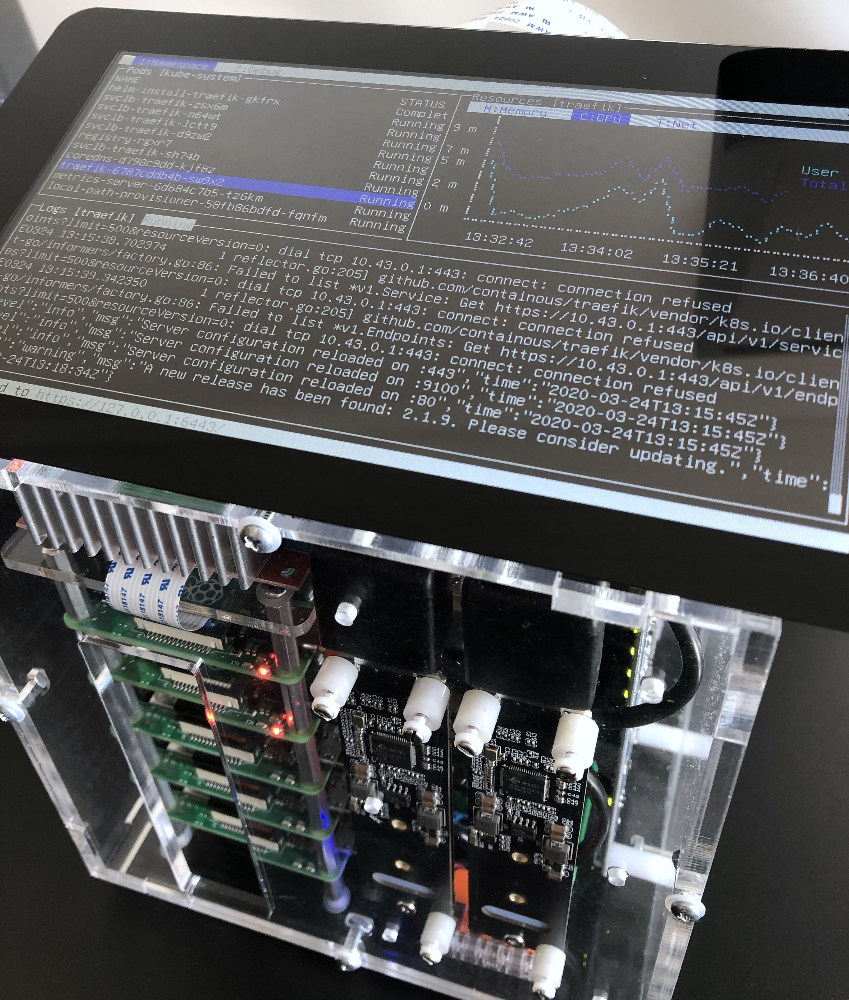

<figure class="fullwidth"></figure>

A year ago, I decided I would build my own Kubernetes cluster.
As a software engineer, I either use a local single-node Kubernetes cluster[^1], or a remote multi-node cluster, to test my work on a daily basis.
I wanted to have the benefits of both, that is being able to use a multi-node cluster, without any of the latencies you can experience while working with a remote environment.

[^1]: I usually rely on [Minikube](https://minikube.sigs.k8s.io), though other solutions exist, like [Kind](https://kind.sigs.k8s.io), that can actually emulate multiple nodes. Mutli-node support [may eventually come](https://github.com/kubernetes/minikube/issues/94) for Minikube.

<!-- excerpt -->

There are a number of excellent _how-to_ already available on building and setting-up a multi-node Kubernetes cluster using [Single-Board Computers](https://en.wikipedia.org/wiki/Single-board_computer).
A lot of them choose the Rapsberry Pi as SBC, and I decided to follow that path of least resistance.
The Raspberry Pi has proven to be both an approachable and affordable[^2] platform.
However, I found none of these setups would meet all of the following requirements.

[^2]: Broadcom and the RPi foundation did not license the ARMv8 crypto extensions (as necessary for hardware accelerated AES support). The microSD card, as the default solution to boot the OS, is another trade-off.

## Requirements

- The cluster should be **enclosed in a standalone _unit_**, that can easily be manipulated, open and maintained modularly;
- The cluster _unit_ should **not contain any high voltage component**[^3], to lower the risk of electrical shock, that may occur by inadvertently contacting a source of current;
- The cluster can be **operated in a standalone manner**, by plugging in a screen and a keyboard;
- Each worker node can be **powered on/off programmatically**, so that it's ultimately possible to implement [cluster auto-scaling](https://github.com/kubernetes/autoscaler).

[^3]: As a basic safety rule, the cluster must be switched off and the main power supply unplugged, before performing any maintenance operation, as any source of current is potentially dangerous. Still, using low-voltage DC currents decreases the risk of [electrical injury](https://en.wikipedia.org/wiki/Electrical_injury#Pathophysiology).

One hidden goal, behing some of these requirements, is to share the cluster with my 4 years-old daughter.
I hope this will become an educational tool, introducing her to computers, and familiarizing her with shells and terminals 👨‍👧[^4].

[^4]: As I work at home, she is used to coming to my desk, hi-jacking my keyboard and typing random strings. Now, she enjoys having her own computer, with a mechanical keyboard and a retro terminal, while I can work without being interrupted, in addition to being satisfied she starts her journey into the fabulous [history of computing hardware](https://en.wikipedia.org/wiki/History_of_computing_hardware).

## Parts

The following table lists most of the parts that I've used for the assembly.
The prices are intentionally omitted, so is the grand total, as I prefer not knowing how much it costed me 😄.

<div class="fullwidth">

| Part                                                           | Source                                                                   |
| -------------------------------------------------------------- | ------------------------------------------------------------------------ |
| Pico 5S Raspberry Pi starter kit case                          | [picocluster.com][picocluster] (discontinued in favor of the RPi4 cases) |
| 2x Raspberry Pi 4B (4GB), 3x Raspberry Pi 3B+                  | [raspberrypi.org][rpi4]                                                  |
| 5x 32GB class 10/A1 microSD cards                              | [raspberrypi.org][microsd]                                               |
| 2x 0.25m cat.8, 3x 0.15m cat.7, S/FTP ethernet cables          | [1attack.de][1attack]                                                    |
| 2x USB-C, 3x micro-USB, PortaPow 20AWG cables                  | [portablepowersupplies.co.uk][portapow]                                  |
| Official Raspberry Pi 7″ touchscreen monitor                   | [raspberrypi.org][display]                                               |
| Dehner Elektronik STD-12090 12V/DC 9A 108W power supply        | [dehner.net][dehner]                                                     |
| DC 12V to 5V 15A buck converter                                | [droking.com][droking]                                                   |
| Heschen 12V 25A SPST 2-Pin ON/OFF switch                       | [heschen.com][heschen] (seems discontinued)                              |
| Noctua NF-A4x20 5V PWM fan                                     | [noctua.at][noctua]                                                      |
| MOSFET breakout board module switch relay (15A, 30V) 4-outputs | [ebay.com][mosfet]                                                       |
| 2x JMS583 based M.2 NVMe to USB 3.0 adapters                   | [amazon.com][amazon-shinestar]                                           |
| 2x Samsung SSD 970 EVO Plus M.2 PCIe NVMe 500 Go               | [samsung.com][samsung]                                                   |
| 2x 6″/152mm USB 3.0 left angle extension cables                | [usbfirewire.com][usbfirewire]                                           |
| 2x Delock adapter USB 3.0 male-female angled 270° vertical     | [delock.com][delock]                                                     |
| Adafruit flex cable for Raspberry Pi - 24″/610mm               | [adafruit.com][adafruit-cable]                                           |
| Adafruit CSI or DSI cable extender for Raspberry Pi            | [adafruit.com][adafruit-extender]                                        |
| Wago 221 series splicing connectors                            | [wago.com][wago]                                                         |
| Lapp Unitronic 300mm/1200mm 2x0.14mm² spiral cable             | [lappgroup.com][lapp]                                                    |
| Lemo FGG.0B.302.CLAD42 and EGG.0B.302.CLL connectors           | [lemo.com][lemo]                                                         |
| Breadboard Dupont female to female jumper wires ribbon cables  | [adafruit.com][adafruit-jumper]                                          |

<!-- | WR-WTB 4 pins - 2.54mm left angled header bottom locking | [we-online.com][we-online] |
| 1.5 kΩ 0.5W resistor | |
| 2P shunt 5.08 mm | | -->

</div>

[picocluster]: https://www.picocluster.com/collections/raspberry-pi/
[rpi4]: https://www.raspberrypi.org/products/raspberry-pi-4-model-b/
[microsd]: https://www.raspberrypi.org/blog/sd-card-speed-test/
[display]: https://www.raspberrypi.org/products/raspberry-pi-touch-display/
[1attack]: http://1aTTack.de
[portapow]: https://portablepowersupplies.co.uk
[dehner]: https://www.dehner.net/netzteile/informationstechnik/594/tischnetzteil-adapter-tech-std-120w?number=27049
[droking]: https://www.droking.com/Power-Supply-Module-Adapter-DC-4-32V-to-1.2-32V-15A-Buck-Converter-Adjustable-Voltage-Regulator-DC-5V-12V-24V-Charging-Module-Driver-Module
[heschen]: https://www.heschen.com/
[noctua]: https://noctua.at/en/nf-a4x20-pwm
[mosfet]: https://www.ebay.com/itm/301575487589
[amazon-shinestar]: https://www.amazon.com/gp/product/B07K6GPXDV/
[samsung]: https://www.samsung.com/us/computing/memory-storage/solid-state-drives/ssd-970-evo-nvme-m2-500gb-mz-v7e500bw/
[usbfirewire]: https://www.usbfirewire.com/parts/rr-alaf-xxgr.html#RR-ALAF-06GR
[delock]: https://www.delock.com/produkt/65340/merkmale.html
[adafruit-cable]: https://www.adafruit.com/product/1731
[adafruit-extender]: https://www.adafruit.com/product/3671
[wago]: https://www.wago.com/global/electrical-interconnections/discover-installation-terminal-blocks-and-connectors/221
[lemo]: https://lemo.com/en/products/low-voltage-connector/b-connector
[lapp]: https://products.lappgroup.com/online-catalogue/power-and-control-cables/oelflex-connect-systems-solutions/spiralised/unitronic-spiral.html
[adafruit-jumper]: https://www.adafruit.com/category/468

<!-- [we-online]: https://www.we-online.com/catalog/en/WTB_2_54_MALE_LEFT_ANGLED_LOCKING_HEADER_6190XX11021/ -->

The case from _PicoCluster_ has a small form-factor and is very easy to tinker with.
From the starter kit I ordered, I only kept the case[^5], including the fasteners and standoffs, and the 8-ports Gigabit Ethernet switch.
I faced some [under-voltage warnings](https://raspberrypi.stackexchange.com/questions/48329/undervoltage-warning-despite-decent-power-supply/48337), and identified it was caused by the micro-USB cables that come with the kit.
It also comes with a 12V to 5V - 30W step-down/buck converter, that I replaced with a more powerful one, for reasons detailed in the [Power](#power) section below.

[^5]: Retrospectively, I had preferred _PicoCluster_ would sell a version of the kit without any electrical components. Another, more time-consuming alternative, would have been to design the case, and turn the vector drawings to a laser cutting service, proposing acrylic sheets, with electrostatic dissipative coating ideally.

At the time I started this project, they were no plan to have the Raspberry Pi 4 released by 2019.
That explains I still have three RPi3s as worker nodes.
I replaced the two others with RPi4s, for nodes requiring more resources, _i.e._, the master node, and the worker node also used for data backup.

Shortly after the RPi4 came out, _PicoCluster_ released a [new case](https://www.picocluster.com/collections/raspberry-pi4/products/pico-5-raspberry-pi4) specifically for the Rasperry Pi 4, that includes a more poweful power supply, two fans, and a power switch.
However, the case is larger, the fans are likely louder than the _Noctua_ NF-A4x20, whose speed can be controlled with [Pulse-Width Modulation][pwm][^6] depending on the temperature probed from the boards, it includes a mains AC power supply unit and, last but not least, is more expensive.
For these reasons, I'd still be choosing the _Pico 5S_ kit.
It's more work, but I find the end result better, and more rewarding the journey along building it.

[^6]: Both the Broadcom BCM2837 (RPi3) and BCM2711 (RPi4) SoCs have hardware timers capable of generating PWM signals, and it is quite straighforward to generate the [control input signal](https://noctua.at/media/wysiwyg/Noctua_PWM_specifications_white_paper.pdf), expected by the _Noctua_ NF-A4x20 PWM, without overloading the CPU. Besides, the fan is hardly perceptible at half-speed (~2500 RPM), which has proven enough to keep the temperature below 45ºC/113°F under normal load.

[pwm]: https://en.wikipedia.org/wiki/Pulse-width_modulation

## Assembly

### Front Panel

<figure>[^top] </figure>

[^top]: {-}  The screen can easily be moved to bring it closer to the keyboard, or to give access to the top panel and open the case.

The front panel has a hole that exposes the microSD slots.
That's convenient, even if I plan to setup [USB mass storage boot](https://www.raspberrypi.org/documentation/hardware/raspberrypi/bootmodes/msd.md), as soon as it's fully supported by the RPi4.
The hole also helps the air flowing through the case, while the two SSD storage units are placed right in front of the fan, which helps maintaining optimal operating temperature.

The RPi's activity and power LEDs are clearly visible, which gives a quick visual feedback on the cluster status.
The activity LEDs from the 8-ports Gigabit Ethernet switch are also visible.

### Left Panel

<figure>[^pull-up] </figure>

[^pull-up]: {-}  On the bottom-left corner, a small circuit intefaces the Noctua fan 4-pin y-cable and the master RPi. It's hardware [PWM][pwm] capable GPIO is configured to control the fan rotation speed, based on the RPi temperatures, probed via SSH at regular interval. It also reads back the RPM signal from the fan, for monitoring purpose.

The left panel gives access to the RPi GPIOs. One ribbon cable connects the master RPi to the PWM controlled fan.
Another connects the master RPi to the 4-outputs MOSFET switch relay breakout board module, that's used to switch on and off the worker nodes.
Four jumper wires connect each of the worker node to the master RPi, from a GPIO configured to be _active-high_ on poweroff, so that the master can safely switch off powering the node, when it has completed its shutdown sequence.

### Rear Panel

<figure>[^entry] </figure>

[^entry]: {-}  A failed attempt at using a cable entry system, aimed at holding USB 3.0 extension cables. Despite my countless attempts at laying out the cables, I systematically faced some I/O errors during data transfers, that were probably caused by the increased strain induced by the entry system, on the cables themselves, or their connectors.

The rear panel hides all the cables, that are a by-product of artisanal modularlity.
I found difficult to find quality cables. I particularly struggled finding short, angled USB 3.0 extension cables.
Cables are the most numerous moving parts in the assembly, with mechanical and electrical constraints, and they proved to be the major source of trouble.

I had the idea of building a single spiral cable, to replace the DSI ribbon cable that connects the screen, in addition to powering it.
However, I could not find any DSI socket connector, and the perspective of soldering 17-cores 0.14mm² wires managed to refrain me.
I went to using a DSI cable extender, and building a 2-cores micro-USB power spiral cable, so that the screen can be easily moved and unplugged, without opening the case.

### Right Panel

<figure></figure>

The right panel holds the 8-ports Gigabit Ethernet switch.

## Design

### Power

<figure class="fullwidth"></figure>

[^relay] I had to decide what power supply I should use, more specifically what wattage should it be capable of supplying, to meet what's drawn by the cluster.
It's kind of a chicken-egg question, because you can't get any measurements, unless you already have a power supply.

[^relay]: {-}  The 4-outputs MOSFET switch relay breakout board module, is installed at the bottom of the case, and used to switch on and off the worker nodes. It's rated 15A-30V, so it's perfectly capable of sustaining the load for even four RPi4s.

To have an estimation, I turned to the official documentation, that provides some [power requirements](https://www.raspberrypi.org/documentation/faqs/#pi-power) for the Rasperry Pi, and other component specifications.
That gave me the following estimates, based on the reported _average_ consumption figures:

$$
\begin{aligned}
P_{avg} &\approx 5V \times \Bigg( \displaystyle\underbrace{5 \times 0.85}_{\text{RPi3s}} + \displaystyle\underbrace{0.6}_{\text{display}} + \displaystyle\underbrace{2 \times 0.7}_{\text{NVMe SSDs}} + \displaystyle\underbrace{1.2}_{\text{switch}} \Bigg)A \\[2em]
&\approx 5V \times 7.45A \\[0.7em]
&\approx 37.25W
\end{aligned}
$$

And, based on the reported _maximum_ consumption figures:

$$
\begin{aligned}
P_{max} &\approx 5V \times \Bigg( \displaystyle\underbrace{5 \times 1.34}_{\text{RPi3s}} + \displaystyle\underbrace{0.8}_{\text{display}} + \displaystyle\underbrace{2 \times 1.4}_{\text{NVMe SSDs}} + \displaystyle\underbrace{1.5}_{\text{switch}} \Bigg)A \\[2em]
&\approx 5V \times 11.8A \\[0.7em]
&\approx 59W
\end{aligned}
$$

That's well above the power supplied by any AC mains to 5V DC external power supply I could find, as a 10A current becomes demanding for "low-end" components.
That excluded the option of relying on a single external AC to 5V DC power supply.
Conversely, 12V DC converters, capable of supplying power in that range, are pretty common.
So I opted for the _Dehner Elektronik_ STD-12090 12V/DC 9A 108W power supply, coupled to a DC 12V to 5V 75W [buck converter](https://en.wikipedia.org/wiki/Buck_converter)[^7].

[^7]: Another option would have been to rely on five, smaller and less powerful, buck converters, one for each RPi, but that would have complexified the assembly significantly.

The following diagram summarizes the _average_ and _maximum_ power I've been able to measure on the cluster:

import data from './power_sankey'

<Plotly {...data} />

The measurements are compatible with the estimation I did.
The test conditions and the configurations may explain the differences.
I have configured the RPis with Wi-Fi and Bluetooth disabled, and they run headless, which likely explains why the power consumption is lower in my case.

It turns out a 108W power supply is a lot more than what's actually necessary.
Still, it'll leave room for some future upgrades, like replacing the RPi3s with RPi4s for example.

### Data

[^ssd] One of the exciting new features of the RPi4 are the two USB 3.0 ports, that are connected to the BCM2711 SoC using a PCIe link, which is extremely fast and promises very fast data transfer rates.
I decided I would use these USB 3.0 ports, to connect SSD drives using M.2 NVMe to USB 3.0 adapters.
However, it turned out finding such a compatible adapter is a challenge.
I had naively assumed any adapters would work, so I bought a first adapter, without checking its compatibility with the RPi4.

I luckily stumled on the [Raspberry Pi 4 USB Boot Config Guide for SSD/Flash Drives](https://jamesachambers.com/raspberry-pi-4-usb-boot-config-guide-for-ssd-flash-drives/) by _James Chambers_, and then bought the recommanded _Shinestar_ M.2 NVMe to USB 3.0 adapter.
It has almost the same form-factor as the M.2 NVMe 2280 size (22mm wide and 80mm long), which is a perfect fit for the _Pico 5S_ case.
I coupled the adapter with a Samsung SSD 970 EVO Plus M.2 PCIe NVMe 500 Go card.

[^ssd]: {-}  The M.2 NVMe to USB 3.0 adapter

Once I had installed and configured everything, I decided I would do a quick test to check the data transfer rates, by copying a large file from the SSD drive to my laptop, using `scp`:

```sh
$ scp pi@master:<source> <destination>
100% 1181MB  39.0MB/s   00:30
```

I got disappointed with the result, as 39MB/s is far from saturating the rate the Gigabit Ethernet switch can achieve.
I started investigating what could possibly be the bottleneck, and realized one CPU core was always at 100%, each time I was transferring a file.
Once I had identified the bottleneck was the CPU, I quickly found out the RPi4 does not have hardware accelerated AES, as Broadcom and the RPi foundation did not license the ARMv8 crypto extensions.
Interestingly, the CPU has become the bottleneck with the RPi4, while it used to be the USB 2.0 and networking interfaces with the RPi3.

A quick test, using `netcat`, gave a much better transfer rate of 104MB/s in the same conditions:

```sh
$ nc -l 6000 | dd bs=1m of=<destination> & ssh pi@master "dd bs=1M if=<source> | nc -q 0 $(hostname -I | awk '{print $1}') 6000"
[1] 71300 71301
1181+1 records in
1181+1 records out
1238558304 bytes (1.2 GB, 1.2 GiB) copied, 11.8632 s, 104 MB/s
0+740624 records in
0+740624 records out
1238558304 bytes transferred in 14.212518 secs (87145593 bytes/sec)
[1]  + 71300 done       nc -l 6000 |
       71301 done       dd bs=1m of=<destination>
```

I have installed a second SSD drive, that's connected to the other RPi4.
I plan to use it for backing up the first drive, using a tool such as [Restic](https://restic.net).

I also plan to use SSD drives for USB mass storage boot, as soon as it's fully supported by the RPi4.
It promises much faster and more reliable performance, compared to microSD.

## Software

As a software engineer, I felt that part to be the easiest.
The awesome work the Rancher team is doing with [k3s](https://k3s.io) certainly helped there.
I won't go too much into the details of setting up a Kubernetes cluster with Raspberry Pis using _k3s_.
I would recommend the awesome [k8-on-raspbian](https://github.com/teamserverless/k8s-on-raspbian) tutorial by _Alex Ellis_.
That being said, here is the gist of it:

Enable _cgroups_, on each node:

```sh
$ sudo sed -i '$ s/$/ cgroup_enable=cpuset cgroup_memory=1 cgroup_enable=memory/' /boot/cmdline.txt
$ sudo reboot
```

Install _k3s_ on the **master** node:

```sh
$ curl -sfL https://get.k3s.io | sh -s - --write-kubeconfig-mode 644
# To check the service status
$ sudo systemctl status k3s
```

Retrieve the _token_, which authorizes the worker nodes to connect to the master node:

```sh
$ sudo cat /var/lib/rancher/k3s/server/node-token
```

Install _k3s_ on each **worker** node:

```sh
$ curl -sfL https://get.k3s.io | K3S_URL="https://<MASTER_IP>:6443" K3S_TOKEN="<NODE_TOKEN>" sh -
# To check the service status
$ sudo systemctl status k3s-agent
```

If you plan to rely on the internal container image registry, that's installed by default, you may have to declare it as an insecure registry, to allow _containerd_ to pull images from it:

```sh
$ sudo sh -c 'REGISTRY=$(kubectl get svc -n kube-system registry -o jsonpath={.spec.clusterIP}); \
cat <<EOT >> /etc/rancher/k3s/registries.yaml
mirrors:
  "$REGISTRY":
    endpoint:
      - "http://$REGISTRY"
EOT'
$ sudo service k3s restart
```

I've used [Kubebox](https://github.com/astefanutti/kubebox), as interactive dashboard, displayed on the screen.

Almost ironically, it turns out a lot more difficult to find multi-architecture images, or to build ARM compatible versions manually, than to setup Kubernetes.

## Future

I plan to write a series of follow-up blog posts, that'll specifically cover some areas in more depth, _e.g._:

- Software-based worker nodes powering and [cluster auto-scaling](https://github.com/kubernetes/autoscaler);
- Installing and controlling the PWM fan, based on the Raspberry Pis temperatures;
- Installing [Pi-Hole](https://pi-hole.net) on Kubernetes with [MetalLB](https://metallb.universe.tf).

There are also a couple of things I still plan to do, like:

- Setting up [USB mass storage boot](https://www.raspberrypi.org/documentation/hardware/raspberrypi/bootmodes/msd.md) with SSD drives;
- Configuring data backup, using a tool such as [Restic](https://restic.net).

I'm pretty sure I've forgotten a large portion of the zillions things I've learnt there.
As a software engineer, I'm used to breaking things quite inconsequently.
Hardware, from my experience, seems far less tolerant to _try-and-error_ cycles.

In general, the more I learn, the more fascinated I become by software and hardware, how human ingenuity has managed to bridge electrical phenomena and programming languages, towards, what looks like, an approximation of the mind control over matter.
